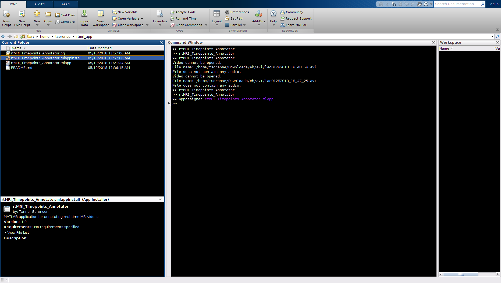
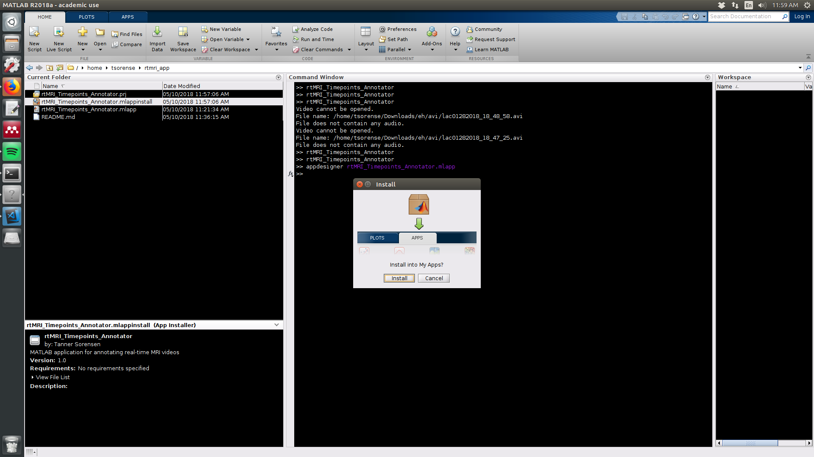
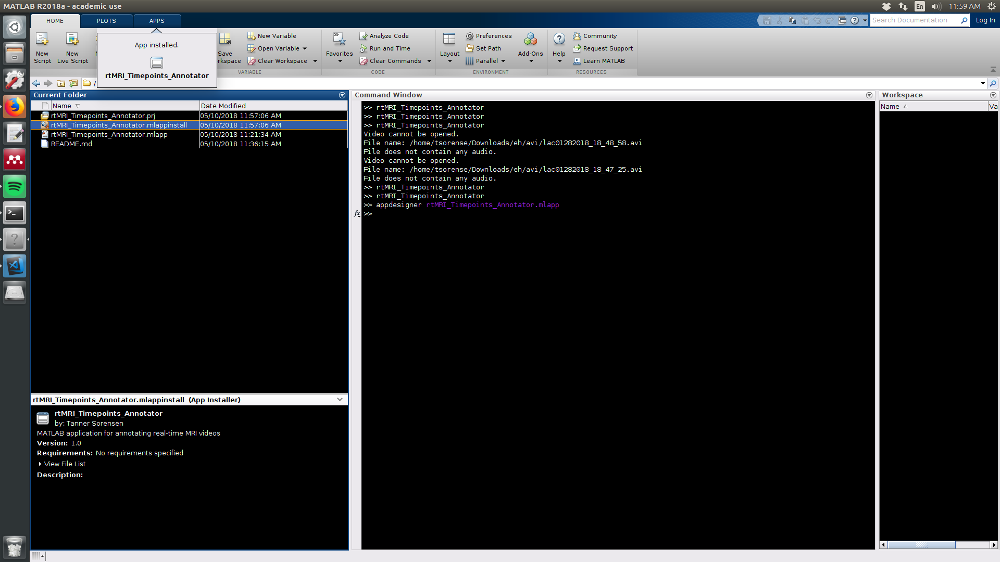
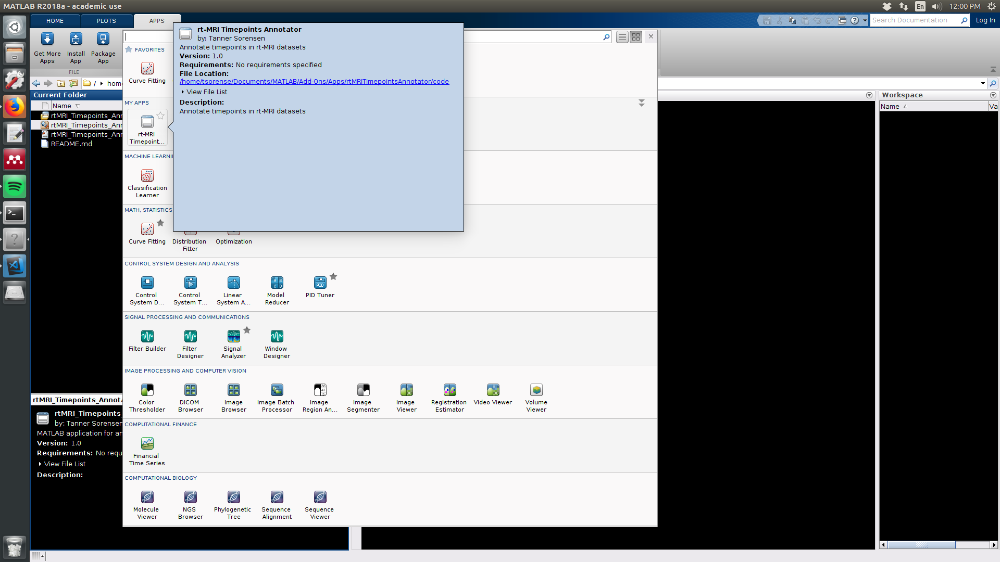
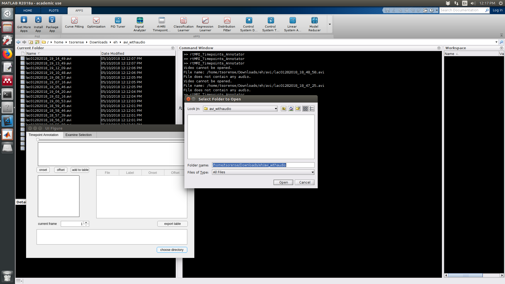
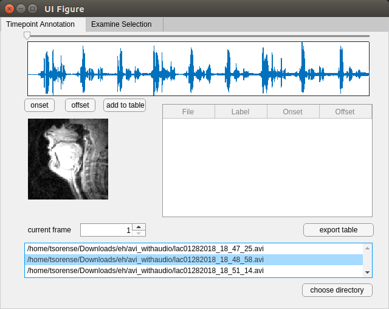
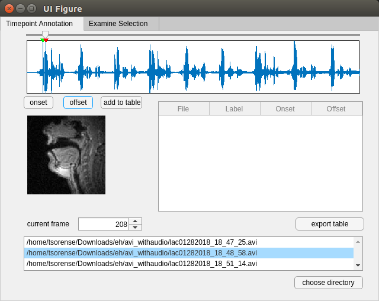
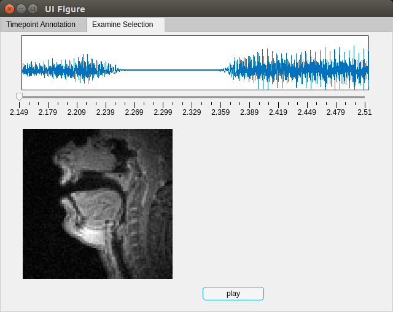
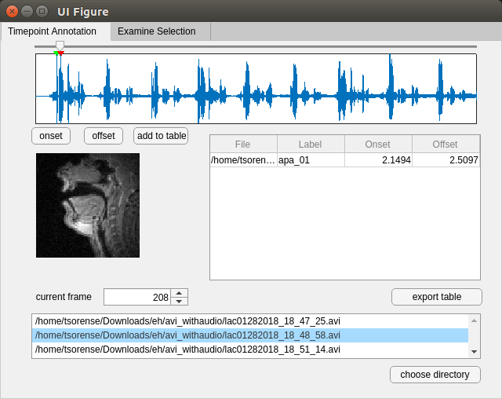
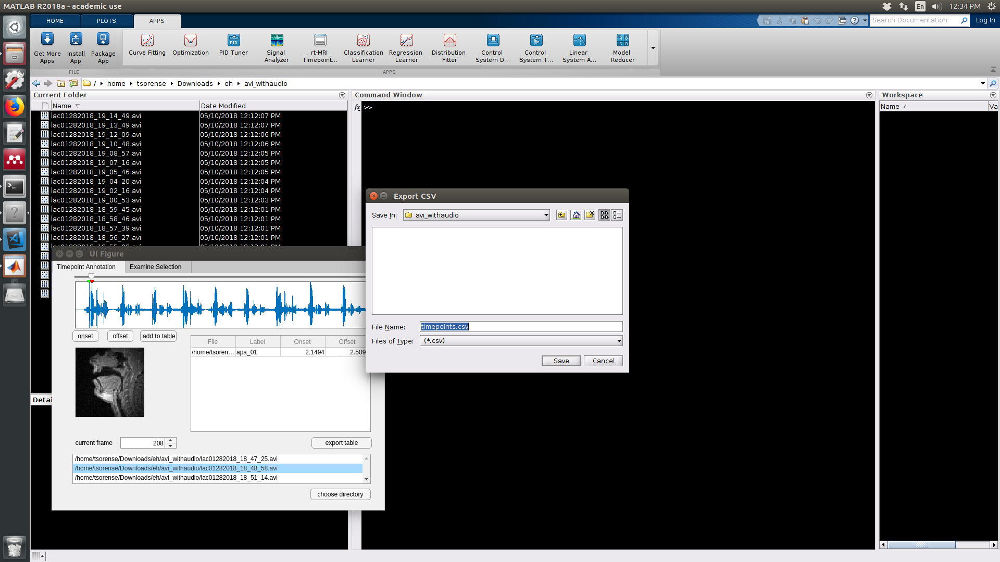

# Real-time MRI Timepoints Annotator

This repository contains the code for a MATLAB application for annotating time-points in real-time MRI videos. 

## Contributors

Tanner Sorensen  
Signal Analysis and Interpretation Laboratory  
University of Southern California

## Installation

Open MATLAB with the desktop GUI. Double click on the file "rtMRI_Timepoints_Annotator.mlappinstall".



Click "Install" in the dialogue box.



The application will appear in the "APPS" tab.



Click on the tab. You will find the application "rtMRI_Timepoints_Annotator" in the dropdown menu. 



## Usage

Click on the "APPS" tab. Open the application "rtMRI_Timepoints_Annotator" in the dropdown menu. 

Click on the button "choose directory". Open the directory containing the avi files (see Section "Generating audio-video files for analysis" below).



A list of avi files in the directory appears. Click on the file you want to analyze.



Use the top slider and "current frame" up/down arrows to navigate to the video frame at the start of the time-interval you are interested in. Click "onset" to set the start of the time-interval. navigate to the video frame at the end of the time-interval you are interested in. Click "offset" to set the end of the time-interval.



Click on the "Examine Selection" tab and then the "play" button to review the video and audio from the selected time-interval.



Return to the "Timepoint Annotation" tab. If the selection must be revised, reselect onset and offset time-points. Otherwise, click "add to table" in order to add the time-interval to the table. Label the time-interval by clicking in the cell beneath the column "Label" in the table. 



Click "export table" to write the table to csv file. 



## Generating audio-video files for analysis

The application will open real-time MRI videos without interleaved audio, but to fully utilize the application, avi files should have both audio and video streams.

Navigate to the directory containing folders `avi` and `wav` that have video and audio files, respectively. 

```bash
tsorense@tsorense-Precision-WorkStation-T3500:~/Downloads/eh$ ls *
avi:
lac01282018_18_47_25.avi  lac01282018_18_52_37.avi  lac01282018_18_56_27.avi  lac01282018_18_59_45.avi  lac01282018_19_04_20.avi  lac01282018_19_08_57.avi  lac01282018_19_13_49.avi
lac01282018_18_48_58.avi  lac01282018_18_54_00.avi  lac01282018_18_57_39.avi  lac01282018_19_00_53.avi  lac01282018_19_05_46.avi  lac01282018_19_10_48.avi  lac01282018_19_14_49.avi
lac01282018_18_51_14.avi  lac01282018_18_55_08.avi  lac01282018_18_58_46.avi  lac01282018_19_02_16.avi  lac01282018_19_07_16.avi  lac01282018_19_12_09.avi

wav:
lac01282018_18_47_25.wav  lac01282018_18_52_37.wav  lac01282018_18_56_27.wav  lac01282018_18_59_45.wav  lac01282018_19_04_20.wav  lac01282018_19_08_57.wav  lac01282018_19_13_49.wav
lac01282018_18_48_58.wav  lac01282018_18_54_00.wav  lac01282018_18_57_39.wav  lac01282018_19_00_53.wav  lac01282018_19_05_46.wav  lac01282018_19_10_48.wav  lac01282018_19_14_49.wav
lac01282018_18_51_14.wav  lac01282018_18_55_08.wav  lac01282018_18_58_46.wav  lac01282018_19_02_16.wav  lac01282018_19_07_16.wav  lac01282018_19_12_09.wav
```

Combine the audio and video files using the following commands.

```bash
tsorense@tsorense-Precision-WorkStation-T3500:~/Downloads/eh$ mkdir avi_withaudio; for i in $(ls avi); do ffmpeg -i "avi/$i" -i "wav/${i/.avi/.wav}" -c copy "avi_withaudio/$i"; done
```

This produces a directory `avi_withaudio`, containing the avi files with both audio and video streams.

```bash
tsorense@tsorense-Precision-WorkStation-T3500:~/Downloads/eh$ ls avi_withaudio/
lac01282018_18_47_25.avi  lac01282018_18_52_37.avi  lac01282018_18_56_27.avi  lac01282018_18_59_45.avi  lac01282018_19_04_20.avi  lac01282018_19_08_57.avi  lac01282018_19_13_49.avi
lac01282018_18_48_58.avi  lac01282018_18_54_00.avi  lac01282018_18_57_39.avi  lac01282018_19_00_53.avi  lac01282018_19_05_46.avi  lac01282018_19_10_48.avi  lac01282018_19_14_49.avi
lac01282018_18_51_14.avi  lac01282018_18_55_08.avi  lac01282018_18_58_46.avi  lac01282018_19_02_16.avi  lac01282018_19_07_16.avi  lac01282018_19_12_09.avi
```

## Troubleshooting

If you are using a version of MATLAB older than 2018a, a dialogue box may appear indicating that the application was built on a newer version of MATLAB. Malfunction of the application may in this case might be resolved by upgrading MATLAB to the latest version. 

Low-level graphics errors can occur. MATLAB has a page of documentation for solving these issues ([link](https://www.mathworks.com/help/matlab/creating_plots/resolving-low-level-graphics-issues.html?searchHighlight=low-level%20graphics&s_tid=doc_srchtitle)). If the graphics card is old, one solution is to switch to rendering with Software OpenGL.